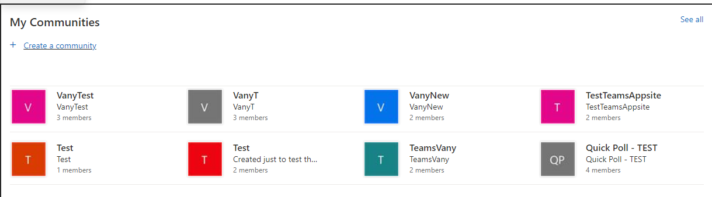
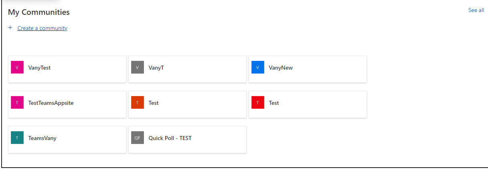
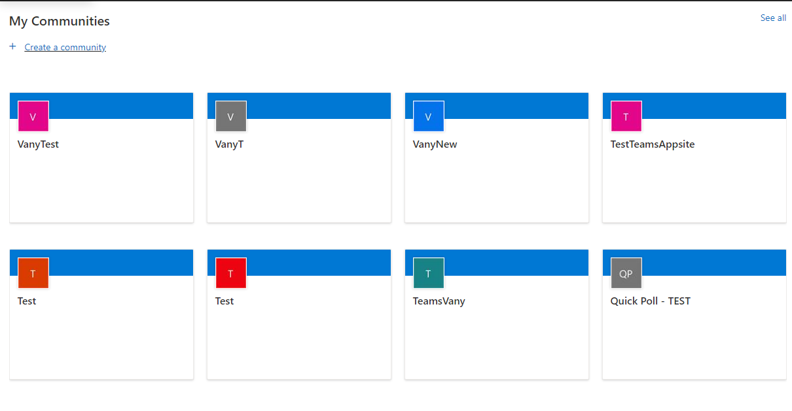
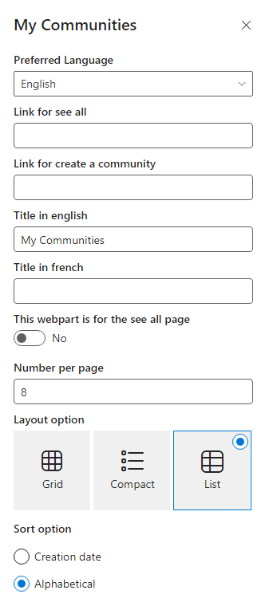

# My Communities

## Summary
- The webpart shows all the SharePoint teams sites (groups) that the current user is a member of with links to the groups' SharePoint sites.
- Able to change the language (English/French) in the property pane.
- Option to show all groups, this will show 20 groups at the time (with pagination).
- Ability to add the url for the See all page.
- Create a community link available to redirect at a specific page for the creation of the new group.
- You can enter the number of groups to display in the property pane.
- **If the user have more groups, see all button will show. In the setting, a input is available for the see all link.**
- Able to change between three different layouts through the settings in the property pane.
- Ability to sort alphabetically or date the group was created.

### List Layout:

### Compact Layout:

### Grid Layout:

### Settings / Property Pane:

## Prerequisites
None.

## API permission
Microsoft Graph - User.ReadBasic.All
Microsoft Graph - Group.Read.All

## Version 

## Applies to
- [SharePoint Framework](https://aka.ms/spfx)
- [Microsoft 365 tenant](https://docs.microsoft.com/en-us/sharepoint/dev/spfx/set-up-your-developer-tenant)

> Get your own free development tenant by subscribing to [Microsoft 365 developer program](http://aka.ms/o365devprogram)

## Version history

Version|Date|Comments
-------|----|--------
1.0|Dec 9, 2021|Initial release
1.1|March 25, 2022|Next release
1.3|November 10, 2023| Upgraded to SPFX 1.17.4

## Minimal Path to Awesome
- Clone this repository
- Ensure that you are at the solution folder
- To install the dependencies, in the command-line run:
  - **npm install**
- To debug in the front end:
  - go to the `serve.json` file and update `initialPage` to `https://your-domain-name.sharepoint.com/_layouts/15/workbench.aspx`
  - In the command-line run:
    - **gulp serve**
- To deploy:
  - In the command-line run:
    - **gulp clean**
    - **gulp bundle --ship**
    - **gulp package-solution --ship**
  - Add the webpart to your tenant app store
- Approve the web API permissions
- Add the Webpart to a page
- Modify the property pane according to your requirements

## Disclaimer

**THIS CODE IS PROVIDED *AS IS* WITHOUT WARRANTY OF ANY KIND, EITHER EXPRESS OR IMPLIED, INCLUDING ANY IMPLIED WARRANTIES OF FITNESS FOR A PARTICULAR PURPOSE, MERCHANTABILITY, OR NON-INFRINGEMENT.**